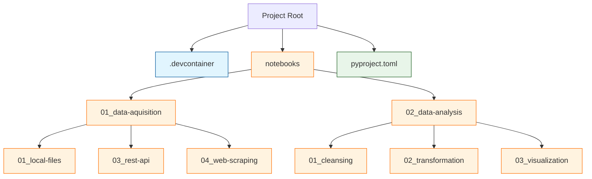
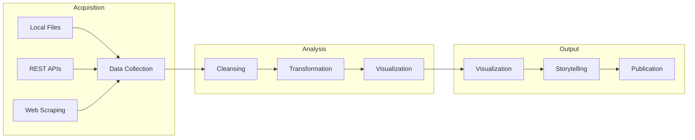

# Data Journalism Python Tutorial
This tutorial series aims to empower journalists with practical Python skills for data-driven storytelling. We focus on real-world journalism scenarios and common data sources that reporters encounter in their daily work.

## 📁 Project Structure

A comprehensive tutorial series designed for journalists transitioning into data-driven journalism, with no prior programming experience required.

- 



```bash
.
├── .devcontainer
│   └── devcontainer.json      # Development container configuration
├── notebooks
│   ├── 01_acquisition
│   │   ├── 01_local-files.ipynb     # Working with local data sources
│   │   ├── 02_rest-apis.ipynb        # API integrations
│   │   └── 03_web-scraping.ipynb     # Web scraping tutorials
│   └── 02_analysis
│       ├── 01_cleansing       # Data cleaning techniques
│       ├── 02_transformation  # Data transformation methods
│       └── 03_visualization   # Visualization guides
├── pyproject.toml             # Project dependencies and settings
└── src                        # Source code for reusable functions
```

## 📚 Prerequisites

- No programming experience required
- Basic spreadsheet knowledge (Excel/Google Sheets)
- Understanding of basic journalism principles
- Installation of Python 3.12+ (instructions provided)

## Workflow


## 🗂 Course Structure

### 1. Data Acquisition
Learn how to gather data from various sources common in journalism:

#### Local Files
- Working with Excel, CSV, JSON and PDF files
- Scanning and digitizing paper documents
- Organizing local data repositories

#### Databases
- Introduction to SQL for journalists
- Accessing public databases
- Working with election data

#### REST APIs
- Understanding API basics
- Accessing census data
- Working with government data portals

#### Web Crawling
- Basic web scraping ethics and principles
- Extracting data from public websites
- Automating data collection

#### Public Records
- Making FOIA requests
- Processing government documents
- Working with public datasets

### 2. Data Analysis

#### Data Cleansing
- Identifying data quality issues
- Handling missing values
- Standardizing formats
- Fact-checking techniques

#### Data Transformation
- Filtering and sorting
- Aggregating data
- Joining different data sources
- Creating derived metrics

#### Statistical Basics
- Understanding basic statistics for journalism
- Identifying patterns and outliers
- Verification and cross-referencing

#### Data Visualization
- Creating compelling charts
- Maps and geographical data
- Interactive visualizations
- Storytelling through data


## 🔄 Component Overview

### Development Container (.devcontainer)
- Provides consistent development environment
- Pre-configured Python setup
- Required extensions and dependencies
- Reproducible across systems

### Notebooks Structure
Each notebook folder contains:
- README.md with section overview
- Example datasets
- Tutorial notebooks (.ipynb)
- Exercise templates
- Solution notebooks

### Source Code (src/)
- Reusable helper functions
- Data processing utilities
- Common transformations
- Visualization templates

### Project Configuration (pyproject.toml)
- Project dependencies
- Development tools
- Build settings
- Package metadata

## 🛠 Technical Setup

This project uses a development container for consistent environments. To get started:

1. Install Visual Studio Code
2. Install Docker Desktop
3. Clone this repository
4. Open in VS Code with Dev Containers extension

## 📊 Tutorial Structure

### Data Acquisition (01_acquisition)
Each module contains practical exercises and real-world examples:

#### 01_local-files
- CSV, Excel, and PDF processing
- Data import/export techniques
- File organization strategies

#### 02_rest-apis
- API authentication
- Data retrieval
- Response parsing

#### 03_web-scraping
- HTML basics
- Ethical scraping
- Data extraction

### Data Analysis (02_analysis)

#### 01_data-cleansing
- Data validation
- Error correction
- Format standardization

#### transformation
- Data reshaping
- Feature engineering
- Aggregation methods

#### visualization
- Chart selection
- Interactive visualizations
- Story-driven design

### Data Analysis (03_advanced)
