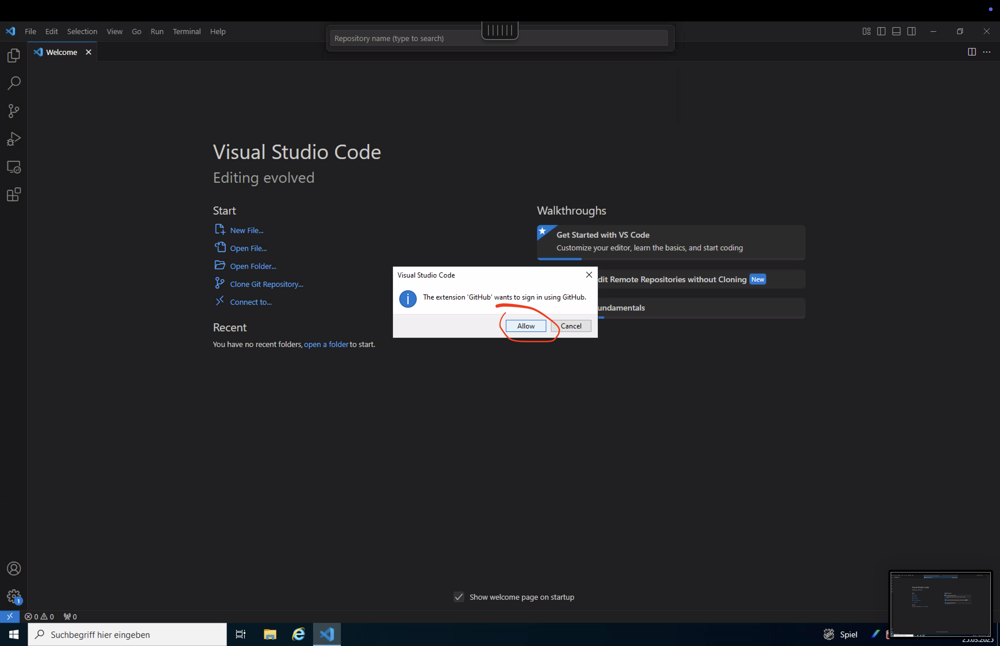
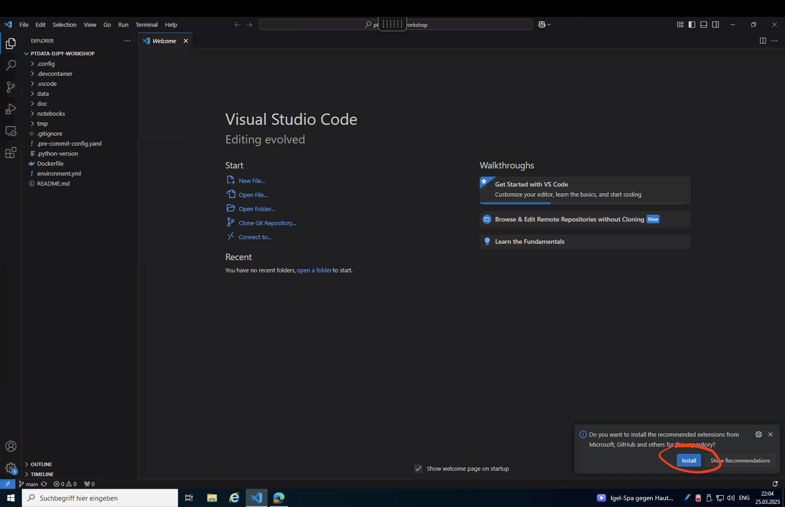

# Data Journalism Python Tutorial

## 📚 Prerequisites (Windows)

Before starting, you'll need to install:

- Visual Studio Code
- Git
- Python 3.12+
- Miniconda
- PowerShell 7.2+

Don't worry if you don't have these installed yet—follow the step-by-step instructions below.

> **Note:** If you run into any issues in the `Prerequisits` or `Getting Started` sections, please refer to below `Troubleshooting` guide.

## 🔧 Prerequisits

If you are working on managed Citrix machines, you can (hopefully) skip these steps.
In case you encounter any issues during install, please refer to the section below to +shoot your issue.

### 1. Install Visual Studio Code

1. Download from [code.visualstudio.com](https://code.visualstudio.com/)
2. Run the installer and follow the prompts
3. Launch VS Code after installation

### 2. Install PowerShell 7.2+

1. Download the installer from [Microsoft PowerShell](https://github.com/PowerShell/PowerShell/releases)
2. Choose PowerShell-7.2.x-win-x64.msi or newer
3. Run the installer with default options
4. Verify by opening PowerShell 7 and running: `$PSVersionTable.PSVersion`

```bash
 $PSVersionTable.PSVersion # 7.x
```

> **Note:** The following steps are optional, since these are included in the setup scripts (found [here for Windows](../scripts/setup.ps1) and [here for Linux/macOS](../scripts/setup.sh)). You only need to perform these if you run into any issues during installation with the script.

### [OPTIONAL] 3. Install Git

1. Download from [Git for Windows](https://git-scm.com/download/win)
2. Run the installer with default options
3. Verify: Open PowerShell and run

```bash
git --version
```

### [OPTIONAL] 4. Install Python 3.12

1. Go to the [Python Downloads page](https://www.python.org/downloads/)
2. Download the latest Python 3.12.x Windows installer (64-bit)
3. Run the installer
4. **Important:** Check the box that says "Add Python to PATH"
5. Choose "Install Now" (recommended)
6. Wait for the installation to complete
7. Verify installation by opening a new PowerShell window and typing:

```bash
python --version # 3.12.x
```

### [OPTIONAL] 5. Install Miniconda

1. Go to the [Miniconda download page](https://docs.conda.io/en/latest/miniconda.html)
2. Download the latest Windows 64-bit installer for Python 3.9+
3. Run the installer
4. Accept the license agreement
5. Select "Install for Just Me" (recommended)
6. Choose the install location (default is fine)
7. **Important:** Check both options:
- "Add Miniconda3 to my PATH environment variable"
- "Register Miniconda3 as my default Python environment"
8. Complete the installation
9. Verify by opening a new PowerShell window and typing:

```bash
conda --version
```

## 🚀 Getting Started
> **Note:** The command palette (Ctrl+Shift+P) and terminal (Ctrl+Shift+Ö) are essential shortcuts you'll use throughout the workshop.

To get started with this workshop, follow these steps with the accompanying screenshots:

### 1. Clone the Repository

1. Open a browser and navigate to the repository
2. Click on the "Code" button and copy the repository URL

   

### 2. GitHub Authentication

If prompted for GitHub authentication:

1. Sign in to your GitHub account or create one if you don't have it

   

   

   

### 3. Open in VS Code

1. Click on "Open in VS Code" when prompted
   
2. In VS Code, follow the prompts to clone the repository
   
3. You should now see the project files in the Explorer and can close any welcome tabs or unnecessary views by opening the command pallette (`Ctrl+Shift+P`) and typing `Close All Editors`
   

### 4. Install Extensions
> **Note**: Skip this step, if you see any error messages like the one shown in the bottom right of the last image, e.g. stating something like `Extension host has quit unexpectedly` .

1. VS Code will prompt you to install recommended extensions
2. Click "Install" to get all the extensions needed for this workshop
   

### 5. Setup Your Workspace
> **Note**: Skip this step if you have manually installed git, python and conda.

1. Open the terminal (`Ctrl+Shift+Ö`) and run the automated setup
   - Windows
   ```bash
   .\scripts\setup.ps1
   ```

   - macOS/Linux (in Terminal):
   ```bash
   ./scripts/setup.sh
   ```

### 6. Configure Jupyter Server

1. Open the terminal (`Ctrl+Shift+Ö`) and run the automated configuration
   - Windows
   ```bash
   .\scripts\configure-jupyter.ps1
   ```

   - macOS/Linux (in Terminal):
   ```bash
   ./scripts/configure-jupyter.sh
   ```

### 7. Start Jupyer Server

This script will set up the conda environment and install all required packages.

1. Run `jupyter lab` in the Terminal

   

2. The Jupyter Lab server will start and open in your default browser

   

## ℹ️ Troubleshooting

If you encounter issues:
1. **Executable not found**:
   This usually means the program isn't in your PATH environment variable
   1. Check your PATH by opening PowerShell and running: `$env:Path -split ";"`. If You cant find it the relevant executables in the corresponding directories, you may need to add the relevant directory to your PATH:
     - Search for "Edit environment variables" in Windows
     - Edit the PATH variable and add the missing directory
     - Restart PowerShell/VS Code after making changes
   2. If this still does not work try to explicitly **prepend** the installation path to all relevant executables:
     - Python:
       - Windows: `%USERPROFILE%\AppData\Local\Programs\Python\Python312\python.exe --version`
       - Linux/macOS: `$HOME/.local/bin/python3 --version` or `$HOME/Library/Python/3.12/bin/python3 --version`
     - Conda
       - Miniconda:
         - activate:
           - Windows: `%USERPROFILE%\Miniconda3\Scripts\activate.bat djpyworkshop`
           - Linux/macOS: `$HOME/miniconda3/bin/activate djpyworkshop`
         - conda:
           - Windows: `%USERPROFILE%\Miniconda3\Scripts\conda.exe env list`
           - Linux/macOS: `$HOME/miniconda3/bin/conda env list`
     - Anaconda:
       - Windows: `%USERPROFILE%\Anaconda3\Scripts\activate.bat djpyworkshop`
       - Linux/macOS: `$HOME/anaconda3/bin/activate djpyworkshop`
     - Git:
       - Windows: `%PROGRAMFILES%\Git\cmd\git.exe --version`
       - Linux/macOS: `$HOME/.local/bin/git --version` or `/usr/bin/git --version`
2. **Conda environment not activating:**
   - Run VSCode as Administrator
   - Execute: `Set-ExecutionPolicy RemoteSigned`
   - Try activating again: `conda activate djpyworkshop`
3. **Python packages not found:**
   - Ensure you've activated the conda environment
4. **Jupyter notebooks not opening:**
   - Select a Kernel when opening a notebook (use the "djpyworkshop" conda environment kernel)
   - Make sure the Python extension in VS Code is installed
   - Restart VS Code after installing extensions


## 🗂 Course Structure

### 0. Cheatsheet
Basic syntax and common datatypes.

[Cheatsheet](../notebooks/CHEATSHEET.md)

### 1. Ski Price Analysis
Learn how to work with tabular data:

- Data cleaning and transformation
- Statistical analysis of pricing patterns
- Correlation with weather conditions
- Trend visualization

[Ski Price Analysis Notebook](../notebooks/01_ski-prices.ipynb)

### 2. PDF Analysis
Learn techniques for extracting and analyzing text from PDF documents:

- PDF extraction methods
- Text preprocessing
- Natural language processing

[PDF Analysis Notebook](../notebooks/02_pdf-analysis.ipynb)

### 3. AI tools
Learn tools to work with generative AI

- Webscraping via Jina
- Programmatically interacting with Gemini Chatbot

[AI tool Notebook](../notebooks/03_ai-tools.ipynb)


## ℹ️ Details
### VS Code Settings (.vscode folder)
This project includes customized VS Code settings to enhance your development experience:

- **settings.json**: Pre-configured editor settings optimized for Python and Jupyter notebooks
  - Code formatting and linting with Ruff
  - Jupyter notebook settings
  - Terminal integration with conda environments

- **extensions.json**: Recommended VS Code extensions for this project
  - Python and Jupyter support
  - GitHub Copilot
  - Docker integration
  - Markdown editing support

To use these settings, simply open the project in VS Code, and you'll be prompted to install recommended extensions.

### 🔄 Development Container (NOT IMPLEMENTED YET)
This project includes a Development Container configuration for consistent development environments across machines:

- Preconfigured Python environment with all dependencies installed
- VS Code extensions and settings automatically applied
- Isolated environment that won't affect your local system

To use the Development Container:
1. Install the "Remote - Containers" extension in VS Code
2. Open the project in VS Code
3. When prompted, click "Reopen in Container" or use the command palette: "Remote-Containers: Reopen in Container"
4. Wait for the container to build and start (this may take a few minutes the first time)

Once inside the container, all tools and dependencies will be ready to use without manual installation.

### Configuration Files (.config folder)
The project contains configuration files in the `.config` folder:
- **ruff.toml**: Configuration for the Ruff Python linter and formatter

These configurations ensure consistent code style and environment settings across different development environments.
