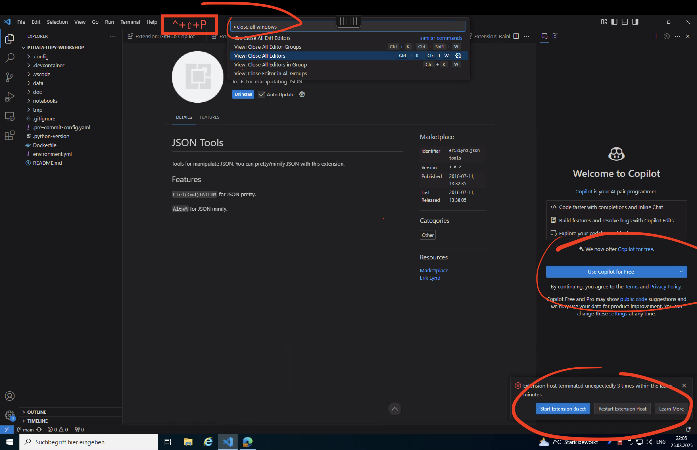
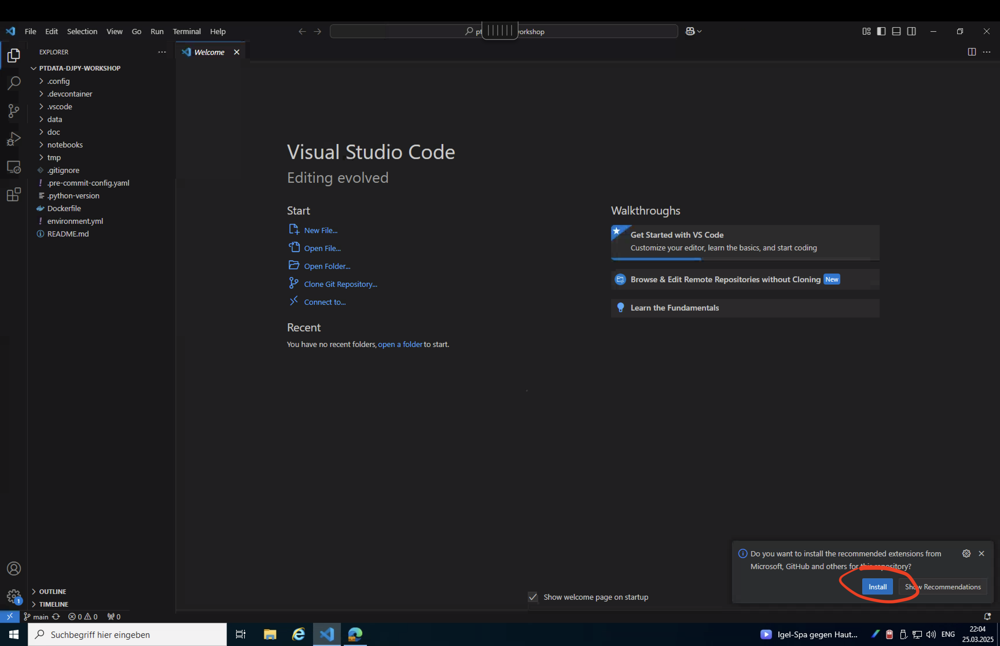

# Datenjournalismus Python Tutorial

## 📚 Voraussetzungen (Windows)

Vor dem Start müssen Sie Folgendes installieren:

- Visual Studio Code
- Git
- Python 3.12+
- Miniconda
- PowerShell 7.2+

Keine Sorge, wenn Sie diese noch nicht installiert haben – folgen Sie einfach der Schritt-für-Schritt-Anleitung unten.

> **Hinweis:** Falls Sie bei den Abschnitten `Voraussetzungen` oder `Erste Schritte` auf Probleme stoßen, konsultieren Sie bitte die unten stehende `Fehlerbehebung`.

## 🔧 Voraussetzungen

Wenn Sie auf verwalteten Citrix-Computern arbeiten, können Sie diese Schritte (hoffentlich) überspringen.
Falls während der Installation Probleme auftreten, konsultieren Sie bitte den untenstehenden Abschnitt zur Fehlerbehebung.

### 1. Visual Studio Code installieren

1. Herunterladen von [code.visualstudio.com](https://code.visualstudio.com/)
2. Installer ausführen und den Anweisungen folgen
3. VS Code nach der Installation starten

### 2. PowerShell 7.2+ installieren

1. Installer von [Microsoft PowerShell](https://github.com/PowerShell/PowerShell/releases) herunterladen
2. PowerShell-7.2.x-win-x64.msi oder neuer wählen
3. Installer mit Standardoptionen ausführen
4. Überprüfen durch Öffnen von PowerShell 7 und Ausführen von: `$PSVersionTable.PSVersion`

```bash
$PSVersionTable.PSVersion # 7.x
```

> **Hinweis:** Die folgenden Schritte sind optional, da sie in den Setup-Skripten enthalten sind ([hier für Windows](../scripts/setup.ps1) und [hier für Linux/macOS](../scripts/setup.sh)). Sie müssen diese nur ausführen, wenn während der Installation mit dem Skript Probleme auftreten.

### [OPTIONAL] 3. Git installieren

1. Von [Git für Windows](https://git-scm.com/download/win) herunterladen
2. Installer mit Standardoptionen ausführen
3. Überprüfen: PowerShell öffnen und ausführen

```bash
git --version
```

### [OPTIONAL] 4. Python 3.12 installieren

1. Zur [Python Download-Seite](https://www.python.org/downloads/) gehen
2. Neuesten Python 3.12.x Windows Installer (64-bit) herunterladen
3. Installer ausführen
4. **Wichtig:** Box "Add Python to PATH" ankreuzen
5. "Install Now" wählen (empfohlen)
6. Installation abwarten
7. Installation überprüfen durch Öffnen eines neuen PowerShell-Fensters und Eingabe von:

```bash
python --version # 3.12.x
```

### [OPTIONAL] 5. Miniconda installieren

1. Zur [Miniconda Download-Seite](https://docs.conda.io/en/latest/miniconda.html) gehen
2. Neuesten Windows 64-bit Installer für Python 3.9+ herunterladen
3. Installer ausführen
4. Lizenzvereinbarung akzeptieren
5. "Install for Just Me" wählen (empfohlen)
6. Installationsort wählen (Standard ist in Ordnung)
7. **Wichtig:** Beide Optionen ankreuzen:
- "Add Miniconda3 to my PATH environment variable"
- "Register Miniconda3 as my default Python environment"
8. Installation abschließen
9. Überprüfen durch Öffnen eines neuen PowerShell-Fensters und Eingabe von:

```bash
conda --version
```

## 🚀 Erste Schritte
> **Hinweis:** Die Befehlspalette (Strg+Shift+P) und das Terminal (Strg+Shift+Ö) sind essentielle Shortcuts, die Sie während des Workshops verwenden werden.

Um mit diesem Workshop zu beginnen, folgen Sie diesen Schritten mit den begleitenden Screenshots:

### 1. Repository klonen

1. Browser öffnen und zum Repository navigieren
2. Auf den "Code" Button klicken und die Repository-URL kopieren

   

### 2. GitHub Authentifizierung

Falls zur GitHub-Authentifizierung aufgefordert:

1. Bei Ihrem GitHub-Konto anmelden oder ein neues erstellen

   

   

   

### 3. In VS Code öffnen

1. Auf "In VS Code öffnen" klicken, wenn aufgefordert
   
2. In VS Code den Aufforderungen zum Klonen des Repositories folgen
   
3. Sie sollten jetzt die Projektdateien im Explorer sehen und können alle Willkommens-Tabs oder unnötige Ansichten schließen, indem Sie die Befehlspalette öffnen (`Strg+Shift+P`) und `Close All Editors` eingeben
   

### 4. Erweiterungen installieren
> **Hinweis**: Überspringen Sie diesen Schritt, wenn Sie Fehlermeldungen wie die im unteren rechten Bereich des letzten Bildes sehen, z.B. etwas wie `Extension host has quit unexpectedly`.

1. VS Code wird Sie auffordern, empfohlene Erweiterungen zu installieren
2. Klicken Sie auf "Installieren", um alle für diesen Workshop benötigten Erweiterungen zu erhalten
   

### 5. Arbeitsbereich einrichten
> **Hinweis**: Überspringen Sie diesen Schritt, wenn Sie Git, Python und Conda manuell installiert haben.

1. Terminal öffnen (`Strg+Shift+Ö`) und das automatische Setup ausführen
   - Windows
   ```bash
   .\scripts\setup.ps1
   ```

   - macOS/Linux (im Terminal):
   ```bash
   ./scripts/setup.sh
   ```

### 6. Jupyter Server konfigurieren

1. Terminal öffnen (`Strg+Shift+Ö`) und die automatische Konfiguration ausführen
   - Windows
   ```bash
   .\scripts\configure-jupyter.ps1
   ```

   - macOS/Linux (im Terminal):
   ```bash
   ./scripts/configure-jupyter.sh
   ```

### 7. Jupyter Server starten

Dieses Skript richtet die Conda-Umgebung ein und installiert alle erforderlichen Pakete.

1. `jupyter lab` im Terminal ausführen

   

2. Der Jupyter Lab Server startet und öffnet sich in Ihrem Standardbrowser

   

## ℹ️ Fehlerbehebung

Bei auftretenden Problemen:
1. **Ausführbare Datei nicht gefunden**:
   Dies bedeutet meist, dass das Programm nicht in Ihrer PATH-Umgebungsvariable ist
   1. Überprüfen Sie Ihren PATH durch Öffnen von PowerShell und Ausführen von: `$env:Path -split ";"`. Wenn Sie die relevanten ausführbaren Dateien nicht in den entsprechenden Verzeichnissen finden können, müssen Sie möglicherweise das relevante Verzeichnis zu Ihrem PATH hinzufügen:
     - Suchen Sie nach "Umgebungsvariablen bearbeiten" in Windows
     - Bearbeiten Sie die PATH-Variable und fügen Sie das fehlende Verzeichnis hinzu
     - Starten Sie PowerShell/VS Code nach den Änderungen neu
   2. Wenn dies immer noch nicht funktioniert, versuchen Sie explizit den Installationspfad allen relevanten ausführbaren Dateien **voranzustellen**:
     - Python:
       - Windows: `%USERPROFILE%\AppData\Local\Programs\Python\Python312\python.exe --version`
       - Linux/macOS: `$HOME/.local/bin/python3 --version` oder `$HOME/Library/Python/3.12/bin/python3 --version`
     - Conda
       - Miniconda:
         - activate:
           - Windows: `%USERPROFILE%\Miniconda3\Scripts\activate.bat djpyworkshop`
           - Linux/macOS: `$HOME/miniconda3/bin/activate djpyworkshop`
         - conda:
           - Windows: `%USERPROFILE%\Miniconda3\Scripts\conda.exe env list`
           - Linux/macOS: `$HOME/miniconda3/bin/conda env list`
     - Anaconda:
       - Windows: `%USERPROFILE%\Anaconda3\Scripts\activate.bat djpyworkshop`
       - Linux/macOS: `$HOME/anaconda3/bin/activate djpyworkshop`
     - Git:
       - Windows: `%PROGRAMFILES%\Git\cmd\git.exe --version`
       - Linux/macOS: `$HOME/.local/bin/git --version` oder `/usr/bin/git --version`
2. **Conda-Umgebung aktiviert sich nicht:**
   - VS Code als Administrator ausführen
   - Ausführen: `Set-ExecutionPolicy RemoteSigned`
   - Erneut aktivieren versuchen: `conda activate djpyworkshop`
3. **Python-Pakete nicht gefunden:**
   - Sicherstellen, dass die Conda-Umgebung aktiviert ist
4. **Jupyter Notebooks öffnen sich nicht:**
   - Beim Öffnen eines Notebooks einen Kernel auswählen (den "djpyworkshop" Conda-Umgebung Kernel verwenden)
   - Sicherstellen, dass die Python-Erweiterung in VS Code installiert ist
   - VS Code nach der Installation von Erweiterungen neu starten

## 🗂 Kursstruktur

### 0. Spickzettel
Grundlegende Syntax und häufige Datentypen.

[Spickzettel](../notebooks/CHEATSHEET.md)

### 1. Skipreis-Analyse
Lernen Sie, wie man mit tabellarischen Daten arbeitet:

- Datenbereinigung und -transformation
- Statistische Analyse von Preismustern
- Korrelation mit Wetterbedingungen
- Trendvisualisierung

[Skipreis-Analyse Notebook](../notebooks/01_ski-prices.ipynb)

### 2. PDF-Analyse
Lernen Sie Techniken zur Extraktion und Analyse von Text aus PDF-Dokumenten:

- PDF-Extraktionsmethoden
- Textvorverarbeitung
- Natürliche Sprachverarbeitung

[PDF-Analyse Notebook](../notebooks/02_pdf-analysis.ipynb)

### 3. KI-Werkzeuge
Lernen Sie Werkzeuge für die Arbeit mit generativer KI

- Webscraping via Jina
- Programmatische Interaktion mit Gemini Chatbot

[KI-Werkzeuge Notebook](../notebooks/03_ai-tools.ipynb)

## ℹ️ Details
### VS Code Einstellungen (.vscode Ordner)
Dieses Projekt enthält angepasste VS Code Einstellungen zur Verbesserung Ihrer Entwicklungserfahrung:

- **settings.json**: Vorkonfigurierte Editor-Einstellungen, optimiert für Python und Jupyter Notebooks
  - Code-Formatierung und Linting mit Ruff
  - Jupyter Notebook Einstellungen
  - Terminal-Integration mit Conda-Umgebungen

- **extensions.json**: Empfohlene VS Code Erweiterungen für dieses Projekt
  - Python- und Jupyter-Unterstützung
  - GitHub Copilot
  - Docker-Integration
  - Markdown-Bearbeitungsunterstützung

Um diese Einstellungen zu nutzen, öffnen Sie einfach das Projekt in VS Code, und Sie werden aufgefordert, die empfohlenen Erweiterungen zu installieren.

### 🔄 Entwicklungscontainer (NOCH NICHT IMPLEMENTIERT)
Dieses Projekt enthält eine Entwicklungscontainer-Konfiguration für konsistente Entwicklungsumgebungen auf verschiedenen Maschinen:

- Vorkonfigurierte Python-Umgebung mit allen installierten Abhängigkeiten
- VS Code Erweiterungen und Einstellungen werden automatisch angewendet
- Isolierte Umgebung, die Ihr lokales System nicht beeinflusst

Um den Entwicklungscontainer zu nutzen:
1. Installieren Sie die "Remote - Containers" Erweiterung in VS Code
2. Öffnen Sie das Projekt in VS Code
3. Wenn aufgefordert, klicken Sie auf "Im Container neu öffnen" oder nutzen Sie die Befehlspalette: "Remote-Containers: Im Container neu öffnen"
4. Warten Sie, bis der Container gebaut und gestartet ist (dies kann beim ersten Mal einige Minuten dauern)

Sobald Sie im Container sind, sind alle Werkzeuge und Abhängigkeiten ohne manuelle Installation nutzungsbereit.

### Konfigurationsdateien (.config Ordner)
Das Projekt enthält Konfigurationsdateien im `.config` Ordner:
- **ruff.toml**: Konfiguration für den Ruff Python Linter und Formatter

Diese Konfigurationen stellen konsistenten Code-Stil und Umgebungseinstellungen über verschiedene Entwicklungsumgebungen hinweg sicher.
