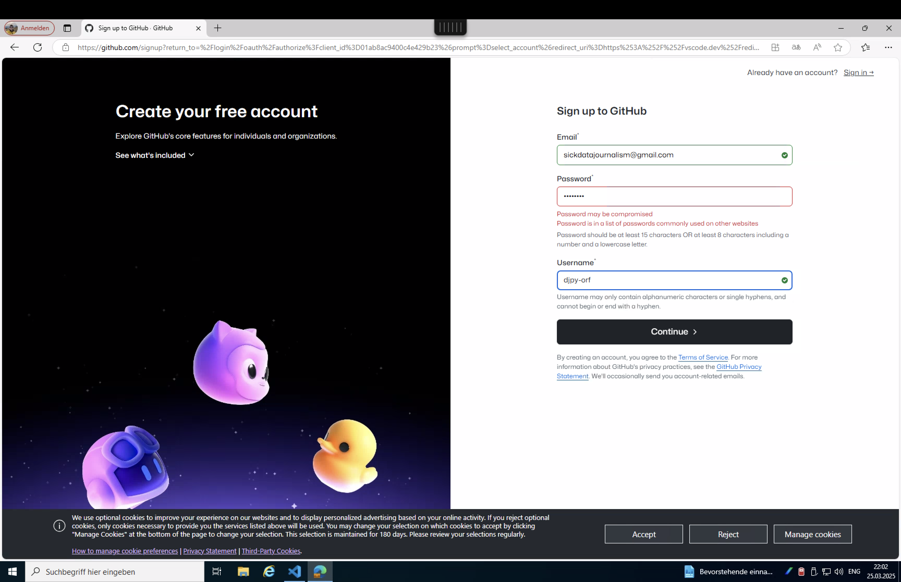
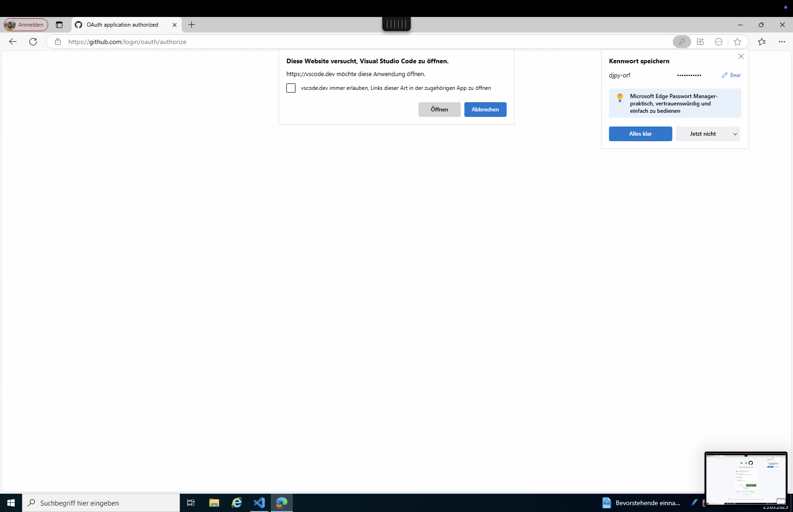

# Datenjournalismus Python Tutorial

## 📚 Voraussetzungen (Windows)

Bevor du beginnst, benötigst du folgende Software:

- Visual Studio Code
- Git
- Python 3.12+
- Miniconda
- PowerShell 7.2+

Keine Sorge, falls du diese Komponenten noch nicht installiert hast – folge einfach der Schritt-für-Schritt-Anleitung unten.

## 🔧 Installationsanleitung für Windows

### 1. Visual Studio Code installieren

1. Lade es von [code.visualstudio.com](https://code.visualstudio.com/) herunter
2. Führe den Installer aus und folge den Anweisungen
3. Starte VS Code nach der Installation

### 2. PowerShell 7.2+ installieren

1. Lade den Installer von [Microsoft PowerShell](https://github.com/PowerShell/PowerShell/releases) herunter
2. Wähle PowerShell-7.2.x-win-x64.msi oder neuer
3. Führe den Installer mit Standardoptionen aus
4. Überprüfe die Installation durch Öffnen von PowerShell 7 und Ausführen von: `$PSVersionTable.PSVersion`

```bash
 $PSVersionTable.PSVersion # 7.x
```

### 3. Git installieren

1. Lade es von [Git for Windows](https://git-scm.com/download/win) herunter
2. Führe den Installer mit Standardoptionen aus
3. Überprüfe: Öffne PowerShell und führe aus

```bash
git --version
```

### 4. Python 3.12 installieren

1. Gehe zur [Python-Download-Seite](https://www.python.org/downloads/)
2. Lade den neuesten Python 3.12.x Windows-Installer (64-bit) herunter
3. Führe den Installer aus
4. **Wichtig:** Aktiviere das Kästchen "Add Python to PATH"
5. Wähle "Install Now" (empfohlen)
6. Warte, bis die Installation abgeschlossen ist
7. Überprüfe die Installation, indem du ein neues PowerShell-Fenster öffnest und eingibst:

```bash
python --version # 3.12.x
```

### 5. Miniconda installieren

1. Gehe zur [Miniconda-Download-Seite](https://docs.conda.io/en/latest/miniconda.html)
2. Lade den neuesten Windows 64-bit-Installer für Python 3.9+ herunter
3. Führe den Installer aus
4. Akzeptiere die Lizenzvereinbarung
5. Wähle "Install for Just Me" (empfohlen)
6. Wähle den Installationsort (Standard ist in Ordnung)
7. **Wichtig:** Aktiviere beide Optionen:
- "Add Miniconda3 to my PATH environment variable"
- "Register Miniconda3 as my default Python environment"
8. Schließe die Installation ab
9. Überprüfe durch Öffnen eines neuen PowerShell-Fensters und Eingabe von:

```bash
conda --version
```

### ℹ️ Fehlerbehebung

Bei Problemen:
1. **Conda-Umgebung wird nicht aktiviert:**
- Führe VSCode als Administrator aus
- Führe aus: `Set-ExecutionPolicy RemoteSigned`
- Versuche erneut zu aktivieren: `conda activate djpyworkshop`
2. **Python-Pakete werden nicht gefunden:**
- Stelle sicher, dass du die Conda-Umgebung aktiviert hast
3. **Jupyter Notebooks öffnen sich nicht:**
- Wähle einen Kernel beim Öffnen eines Notebooks (verwende den "djpyworkshop" Conda-Umgebungskernel)
- Stelle sicher, dass die Python-Erweiterung in VS Code installiert ist
- Starte VS Code nach der Installation von Erweiterungen neu
4. **Ausführbare Datei nicht gefunden**:
- Dies bedeutet normalerweise, dass das Programm nicht in deiner PATH-Umgebungsvariable ist
- Überprüfe deinen PATH durch Öffnen von PowerShell und Ausführen von: `$env:Path -split ";"`
- Möglicherweise musst du das relevante Verzeichnis zu deinem PATH hinzufügen:
  - Suche nach "Umgebungsvariablen bearbeiten" in Windows
  - Bearbeite die PATH-Variable und füge das fehlende Verzeichnis hinzu
  - Starte PowerShell/VS Code nach den Änderungen neu

## 🚀 Erste Schritte

> **Bemerkung:** Die Befehlspalette (Strg+Umschalt+P) und das Terminal (Strg+Umschalt+Ö) sind wichtige Kurzbefehle, die du während des Workshops verwenden wirst.

Um mit diesem Workshop zu beginnen, folge diesen Schritten mit den beigefügten Screenshots:

### 1. Repository klonen

1. Öffne einen Browser und navigiere zum Repository
2. Klicke auf den "Code"-Button und kopiere die Repository-URL

   

### 2. GitHub-Authentifizierung

Falls du zur GitHub-Authentifizierung aufgefordert wirst:

1. Melde dich bei deinem GitHub-Konto an oder erstelle ein neues, falls du keines hast

   

   

   

### 3. In VS Code öffnen

1. Klicke auf "In VS Code öffnen", wenn du dazu aufgefordert wirst

   

2. Folge in VS Code den Anweisungen zum Klonen des Repositories

   

### 4. Erweiterungen installieren

1. VS Code wird dich auffordern, empfohlene Erweiterungen zu installieren
2. Klicke auf "Installieren", um alle für diesen Workshop benötigten Erweiterungen zu erhalten

   

### 5. Arbeitsbereich einrichten

1. Schließe alle Willkommens-Tabs oder unnötige Ansichten
2. Du solltest jetzt die Projektdateien im Explorer sehen

   

### 6. Jupyter-Server konfigurieren

Führe das Setup-Skript manuell aus, um den Jupyter-Server zu konfigurieren:

**Windows (in PowerShell):**
```bash
.\scripts\setup-jupyter.ps1
```

Dieses Skript richtet die Conda-Umgebung ein und installiert alle benötigten Pakete.

### 7. Jupyter-Server starten

1. Führe `jupyter lab` im Terminal aus

   

2. Der Jupyter Lab Server wird gestartet und öffnet sich in deinem Standardbrowser

   

## 🗂 Kursstruktur

### 0. Spickzettel
Grundlegende Syntax und häufige Datentypen.

[Spickzettel](../notebooks/CHEATSHEET.md)

### 1. Skipreis-Analyse
Lerne, wie man mit tabellarischen Daten arbeitet:

- Datenbereinigung und -transformation
- Statistische Analyse von Preismustern
- Korrelation mit Wetterbedingungen
- Trendvisualisierung

[Skipreis-Analyse Notebook](../notebooks/01_ski-prices.ipynb)

### 2. PDF-Analyse
Lerne Techniken zur Extraktion und Analyse von Text aus PDF-Dokumenten:

- PDF-Extraktionsmethoden
- Textvorverarbeitung
- Natürliche Sprachverarbeitung

[PDF-Analyse Notebook](../notebooks/02_pdf-analysis.ipynb)

### 3. KI-Tools
Lerne Werzeuge um mit generativer KI zu arbeiten

- Webpage-Extraktionsmethoden via Jina
- Programmatische Interaktion mit Gemini Chatbot

[KI-Tool Notebook](../notebooks/03_ai-tools.ipynb)

## ℹ️ Details
### VS Code Einstellungen (.vscode Ordner)
Dieses Projekt enthält angepasste VS Code-Einstellungen zur Verbesserung deiner Entwicklungserfahrung:

- **settings.json**: Vorkonfigurierte Editor-Einstellungen, optimiert für Python und Jupyter Notebooks
  - Code-Formatierung und Linting mit Ruff
  - Jupyter Notebook-Einstellungen
  - Terminal-Integration mit Conda-Umgebungen

- **extensions.json**: Empfohlene VS Code-Erweiterungen für dieses Projekt
  - Python- und Jupyter-Unterstützung
  - GitHub Copilot
  - Docker-Integration
  - Markdown-Bearbeitungsunterstützung

Um diese Einstellungen zu verwenden, öffne einfach das Projekt in VS Code, und du wirst aufgefordert, die empfohlenen Erweiterungen zu installieren.

### 🔄 Development Container (NOCH NICHT IMPLEMENTIERT)
Dieses Projekt enthält eine Development Container-Konfiguration für konsistente Entwicklungsumgebungen auf verschiedenen Maschinen:

- Vorkonfigurierte Python-Umgebung mit allen installierten Abhängigkeiten
- VS Code-Erweiterungen und -Einstellungen werden automatisch angewendet
- Isolierte Umgebung, die dein lokales System nicht beeinflusst

Um den Development Container zu verwenden:
1. Installiere die "Remote - Containers" Erweiterung in VS Code
2. Öffne das Projekt in VS Code
3. Wenn du aufgefordert wirst, klicke auf "In Container erneut öffnen" oder verwende die Befehlspalette: "Remote-Containers: Reopen in Container"
4. Warte, bis der Container erstellt und gestartet ist (dies kann beim ersten Mal einige Minuten dauern)

Sobald du im Container bist, sind alle Werkzeuge und Abhängigkeiten einsatzbereit, ohne manuelle Installation.

### Konfigurationsdateien (.config Ordner)
Das Projekt enthält Konfigurationsdateien im `.config` Ordner:
- **ruff.toml**: Konfiguration für den Ruff Python Linter und Formatter

Diese Konfigurationen sorgen für konsistenten Code-Stil und Umgebungseinstellungen über verschiedene Entwicklungsumgebungen hinweg.
